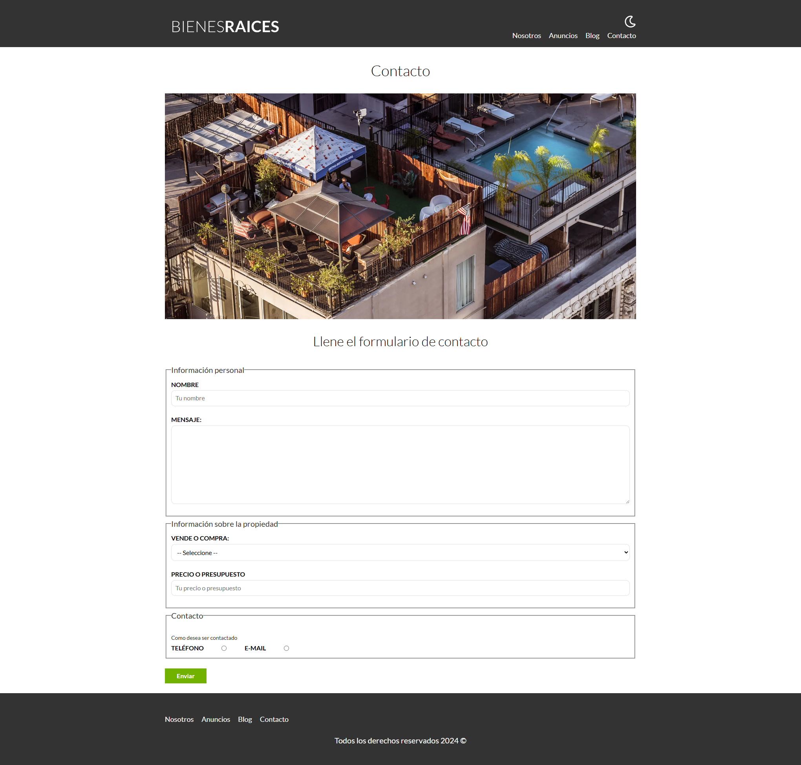

# Bienes raíces
Este proyecto es una página web para la venta de casas y departamentos exclusivos de lujo, desarrollada con PHP, JavaScript y SASS. El sitio cuenta con un diseño elegante y organizado, brindando una experiencia de usuario atractiva e intuitiva. Las secciones principales incluyen "Nosotros", "Anuncios", "Blog" y "Contacto". Además, el sitio incorpora la opción de modo oscuro, lo que permite al usuario cambiar el esquema de colores a su preferencia.

El proyecto está estructurado utilizando el patrón de diseño Modelo-Vista-Controlador (MVC), lo que facilita la organización del código y el mantenimiento de la aplicación. También cuenta con una sección de administración donde se pueden subir casas de lujo, y en la sección de contacto se permite el envío de correos electrónicos.

## Tecnologías usadas

- 
- 
- 

## Autor

- [Simón Risso](https://www.linkedin.com/in/simonrisso/)  

## Capturas de pantalla

### Página Principal

---

| Sección "Nosotros"                   | Sección "Blog"                   |
| -----------------------------------|----------------------------------- |
| ||

---

### Sección "Contacto"
 